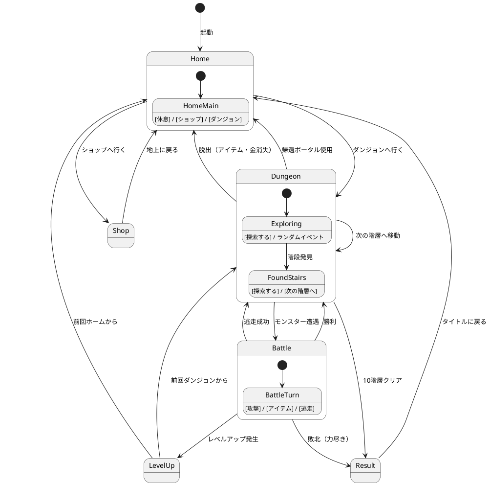
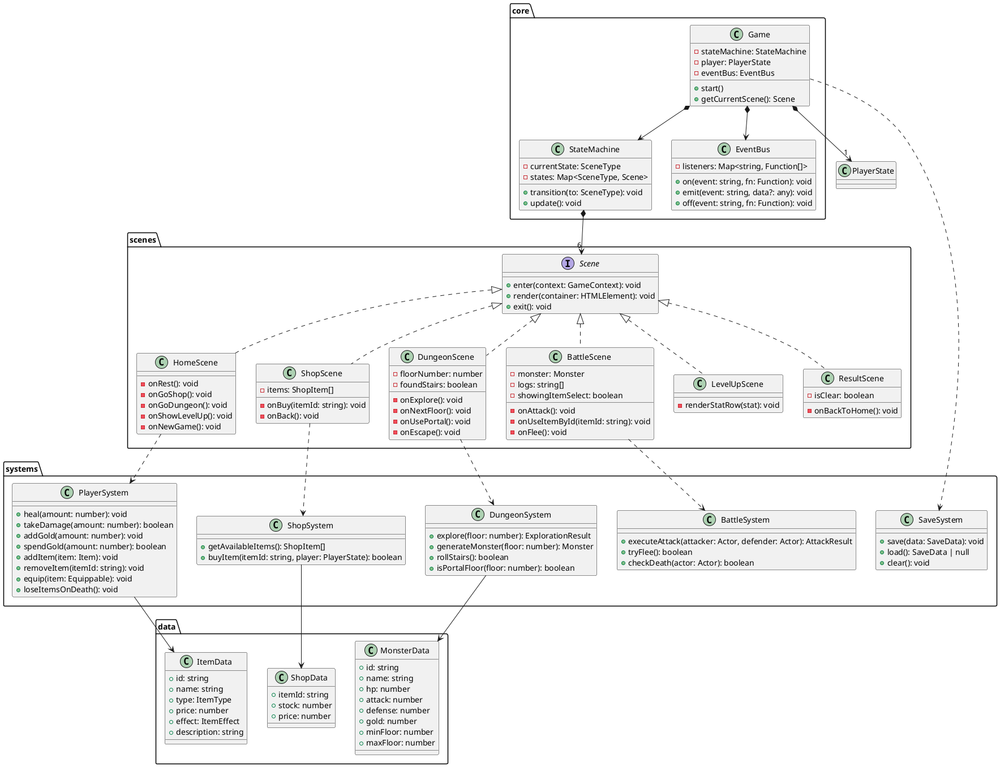

# 基本設計書 — ローグライクダンジョンゲーム

## 1. システム構成

```
┌─────────────────────────────────────────────┐
│                 index.html                   │
│  ┌───────────────────────────────────────┐  │
│  │          main.ts (エントリポイント)    │  │
│  │  Game インスタンス生成 → 初期化 →     │  │
│  │  ループ開始                            │  │
│  └────────────┬──────────────────────────┘  │
│               │                              │
│  ┌────────────▼──────────────────────────┐  │
│  │            Game.ts                     │  │
│  │  全状態を保持、Scene の管理・切り替え │  │
│  │  StateMachine, PlayerState を内包     │  │
│  └────────────┬──────────────────────────┘  │
│               │                              │
│  ┌────────────┼──────────┬───────────────┐  │
│  │            │          │               │  │
│  ▼            ▼          ▼               ▼  │
 │ Scene(6)    System(5)   data/     types/    │
 │ 画面表示・   ゲーム      データ     型定義    │
 │ ユーザー    ロジック    定義                │
 │ 操作受付                                    │
└─────────────────────────────────────────────┘
```

## 2. 画面遷移図（状態遷移図）



## 3. クラス構成図



## 4. ディレクトリ構成

```
/
├── index.html
├── package.json
├── tsconfig.json
├── vite.config.ts
├── docs/
│   ├── requirements.md
│   ├── architecture.md
│   └── detailed-design.md
├── src/
│   ├── main.ts
│   ├── style.css
│   ├── types/
│   │   └── index.ts
│   ├── core/
│   │   ├── Game.ts
│   │   ├── StateMachine.ts
│   │   └── EventBus.ts
│   ├── data/
│   │   ├── items.ts
│   │   ├── monsters.ts
│   │   └── shop.ts
│   ├── systems/
│   │   ├── BattleSystem.ts
│   │   ├── DungeonSystem.ts
│   │   ├── ShopSystem.ts
│   │   ├── PlayerSystem.ts
│   │   └── SaveSystem.ts
│   └── scenes/
│       ├── HomeScene.ts
│       ├── ShopScene.ts
│       ├── DungeonScene.ts
│       ├── BattleScene.ts
│       ├── LevelUpScene.ts
│       └── ResultScene.ts
```

## 5. 画面レイアウト構造

全シーン共通で以下の2領域に分割する:

```
┌──────────────────────┐
│  .content-area       │ ← flex: 1, overflow-y: auto (スクロール可能)
│  ステータス           │
│  メッセージログ       │
│  情報表示             │
│  ...                  │
├──────────────────────┤
│  .action-area         │ ← flex-shrink: 0 (下部固定)
│  [操作ボタン]         │
│  [操作ボタン]         │
└──────────────────────┘
```

- `#app` は `overflow: hidden` + `flex-direction: column`
- `content-area` がスクロールでボタンは常に画面下部に固定表示
- バトル中のアイテム選択画面も同様の構造とする

## 6. 画面レイアウト（ワイヤーフレーム）

### 地上（ホーム）
```
┌──────────────────┐
│  Lv.1 HP:20/20   │← ステータスバー
│  300G            │
│ ████████░░ EXP   │← EXPバー
│  5/20            │
│                  │
│  ◎ ダンジョン    │
│  ◎ ショップ      │
│  ◎ 休息する      │
│  ◎ ステータス    │← 未割り振りPがある場合のみ
│  [ニューゲーム]  │← 赤色
│                  │
│  武器: 木の剣    │
│  アイテム: 2個   │
└──────────────────┘
```

### ショップ
```
┌──────────────────┐
│  ショップ        │
│  所持金: 100G    │
│                  │
│  薬草    50G [買]│
│  木の剣  100G[買]│
│  皮の盾  80G [買]│
│                  │
│  [地上に戻る]    │
└──────────────────┘
```

### ダンジョン探索
```
┌──────────────────────┐
│  .content-area       │
│ ┌──────────────────┐ │
│ │ 3階層  HP:15/20  │ │← ステータスバー
│ └──────────────────┘ │
│ ┌──────────────────┐ │
│ │ [次の階層へ]      │ │← 階段発見時のみ上部に表示
│ └──────────────────┘ │
│ ┌──────────────────┐ │
│ │ 階段を発見した！  │ │← メッセージ
│ └──────────────────┘ │
│ ┌──────────────────┐ │
│ │ 攻撃:5 防御:2    │ │← 情報
│ └──────────────────┘ │
├──────────────────────┤
│  .action-area        │← 下部固定、常に3ボタン横並び
│ [探索する][ｱｲﾃﾑ][脱出]│
└──────────────────────┘
```

- **action-area**: 常に `[探索する] [アイテム] [脱出する]` の3ボタン横並び（10F時も変わらない）
- **content-area上部**: 階段発見時は「次の階層へ」、10F到達時は「帰還ポータルを使う」ボタンを表示

### バトル
```
┌──────────────────────┐
│  .content-area       │
│ ┌──────────────────┐ │
│ │ スライム  HP:5/5 │ │← モンスターバー(赤枠)
│ └──────────────────┘ │
│ ┌──────────────────┐ │
│ │ HP: 15/30        │ │← プレイヤーHP
│ └──────────────────┘ │
│ ┌──────────────────┐ │
│ │ あなたの攻撃!    │ │← ログ
│ │ 5のダメージ!     │ │
│ └──────────────────┘ │
├──────────────────────┤
│  .action-area        │← 下部固定、常に3ボタン横並び
│ [攻撃] [ｱｲﾃﾑ] [逃走] │
└──────────────────────┘
```

### アイテム選択（ダンジョン/バトル内）
```
┌──────────────────────┐
│  .content-area       │
│ ┌──────────────────┐ │
│ │ アイテム選択     │ │
│ │ 小回復薬   [使う]│ │
│ │ 全回復薬   [使う]│ │
│ │ 忘却の薬   [使う]│ │
│ └──────────────────┘ │
├──────────────────────┤
│  .action-area        │
│      [戻る]          │
└──────────────────────┘
```

### レベルアップ画面
```
┌──────────────────┐
│  レベルアップ!   │
│  Lv.1   残りP: 3 │
│                  │
│  体力     [＋]   │
│  攻撃力   [＋]   │
│  素早さ   [＋]   │
│  魔力     [＋]   │
│                  │
│    [決定]        │
└──────────────────┘
```

### リザルト
```
┌──────────────────┐
│                  │
│   ゲームクリア!  │
│   or             │
│   力尽きました   │
│                  │
│  獲得Gold: 200   │
│  到達階層: 10F   │
│                  │
│  [タイトルに戻る]│
│                  │
└──────────────────┘
```
