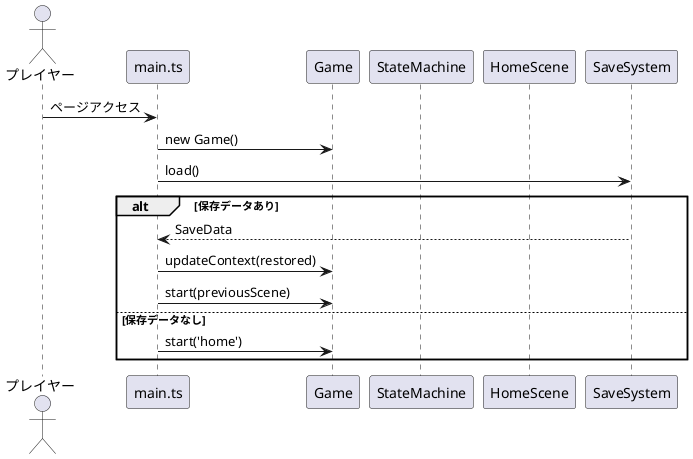
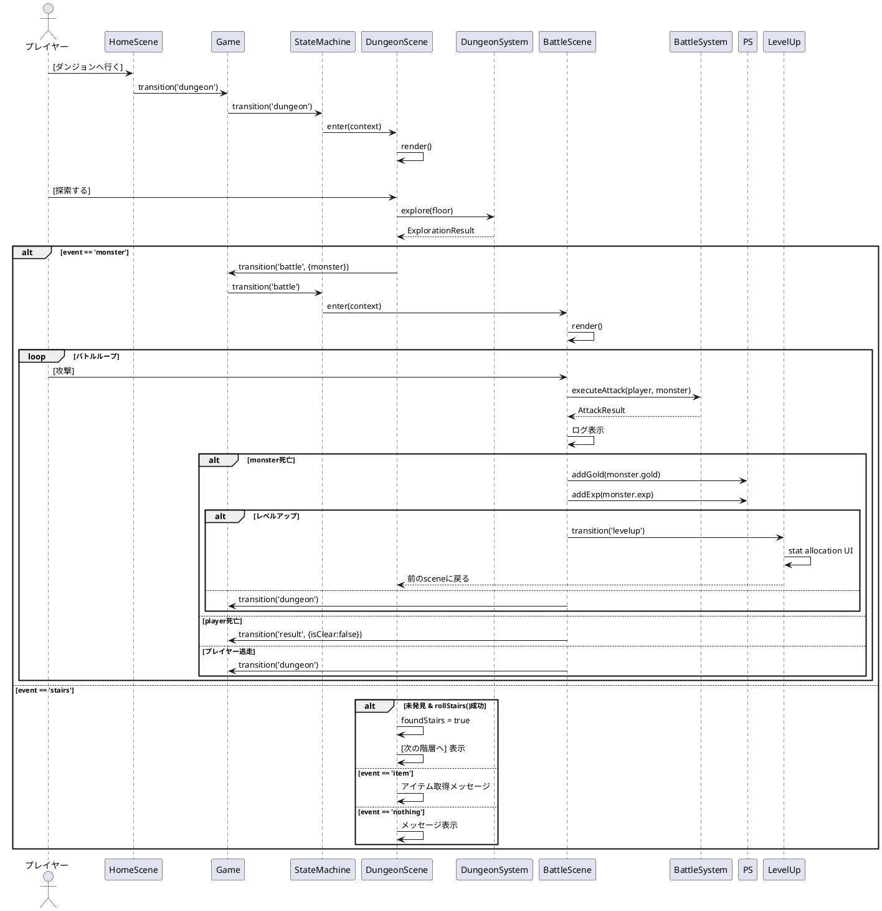
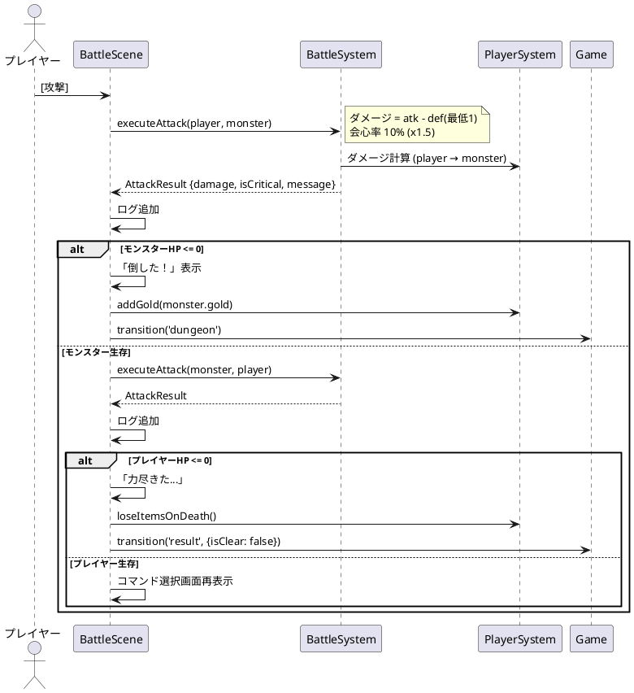
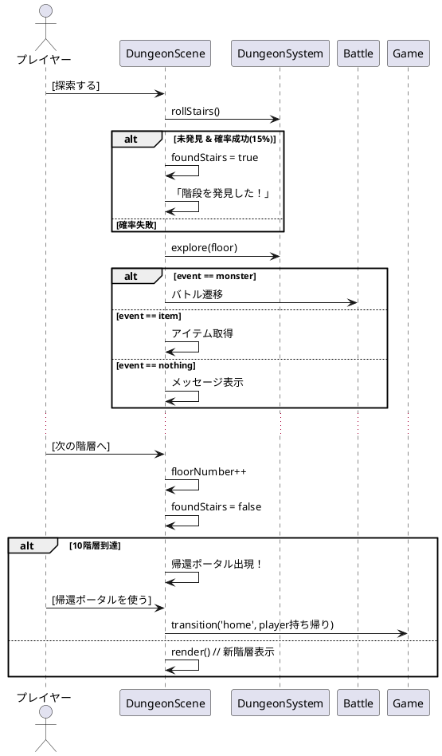

# 詳細設計書 — ローグライクダンジョンゲーム

## 1. データモデル詳細

### 1.1 型定義 (`src/types/index.ts`)

```typescript
// === 型定義 ===

// アイテム種別
type ItemType = 'weapon' | 'armor' | 'consumable';

// アイテム効果
interface ItemEffect {
  heal?: number;         // HP回復量 (consumable)
  attack?: number;       // 攻撃力補正 (weapon)
  defense?: number;      // 防御力補正 (armor)
}

// アイテム
interface Item {
  id: string;
  name: string;
  type: ItemType;
  price: number;
  effect: ItemEffect;
  description: string;
  maxStack?: number;     // スタック可能数 (consumable)
}

// 装備可能アイテム
interface Equippable extends Item {
  type: 'weapon' | 'armor';
  effect: { attack?: number; defense?: number };
}

// 消費アイテム
interface Consumable extends Item {
  type: 'consumable';
  effect: { heal: number };
  maxStack: number;
}

interface StatAllocation {
  hp: number;
  attack: number;
  speed: number;
  magic: number;
}

// モンスター
interface Monster {
  id: string;
  name: string;
  hp: number;
  maxHp: number;
  attack: number;
  defense: number;
  gold: number;
  exp: number;            // 獲得経験値
  minFloor: number;       // 出現最小階層
  maxFloor: number;       // 出現最大階層
}

// 装備スロット
interface Equipment {
  weapon: Equippable | null;
  armor: Equippable | null;
}

// プレイヤー状態
interface PlayerState {
  level: number;
  hp: number;
  maxHp: number;
  baseAttack: number;
  baseDefense: number;
  baseSpeed: number;      // 素早さ
  baseMagic: number;      // 魔力
  gold: number;
  inventory: Consumable[];
  equipment: Equipment;
  floorReached: number;
  exp: number;             // 現在経験値
  expToNext: number;       // 次レベル必要経験値
  statPoints: number;      // 未割り振りポイント
  allocatedStats: StatAllocation;  // 割り振り履歴（リセット用）
}

// Scene 識別子
type SceneType = 'home' | 'shop' | 'dungeon' | 'battle' | 'result' | 'levelup';

// ゲームコンテキスト（Scene間で受け渡す）
interface GameContext {
  player: PlayerState;
  floorNumber: number;
  foundStairs: boolean;
  monster?: Monster;
  result?: GameResult;
  battleMessage: string[];
  previousScene: SceneType | null;  // レベルアップ後の戻り先
}

// 探索結果
interface ExplorationResult {
  event: 'monster' | 'stairs' | 'item' | 'nothing';
  monster?: Monster;
  item?: Consumable;
  message: string;
}

// バトル結果
interface AttackResult {
  damage: number;
  isCritical: boolean;
  message: string;
}

// ゲーム結果
interface GameResult {
  isClear: boolean;
  floorReached: number;
  goldEarned: number;
}

// レベルアップ結果
interface LevelUpResult {
  leveledUp: boolean;
  newLevel: number;
}

// セーブデータ
interface SaveData {
  player: PlayerState;
  floorNumber: number;
  foundStairs: boolean;
  previousScene: SceneType | null;
  battleMessage: string[];
  timestamp: number;
}

// Scene インターフェース
interface Scene {
  type: SceneType;
  enter(context: GameContext): void;
  render(container: HTMLElement): void;
  exit(): void;
}
```

### 1.2 データ定義

#### アイテム (`src/data/items.ts`)

```
【武器】
wooden_sword  木の剣     攻撃+3      100G
iron_sword    鉄の剣     攻撃+6      300G
steel_sword   鋼の剣     攻撃+10     600G

【防具】
leather_shield  皮の盾      防御+2      80G
iron_armor      鉄の鎧      防御+5      250G
steel_armor     鋼の鎧      防御+9      500G

【消費アイテム】
potion_less   小回復薬    HP+20       30G     maxStack:5
potion_mid    中回復薬    HP+50       80G     maxStack:3
potion_full   全回復薬    HP全回復    200G    maxStack:1
```

#### モンスター (`src/data/monsters.ts`)

```
slime       スライム      HP:5  Atk:2  Def:1  Gold:5   Exp:3   1-3F
bat         コウモリ      HP:8  Atk:5  Def:1  Gold:8   Exp:4   1-4F
goblin      ゴブリン      HP:10 Atk:4  Def:2  Gold:10  Exp:5   2-5F
wolf        ウルフ        HP:12 Atk:7  Def:2  Gold:12  Exp:7   3-6F
skeleton    スケルトン    HP:15 Atk:6  Def:3  Gold:15  Exp:8   4-7F
orc         オーク        HP:20 Atk:8  Def:4  Gold:20  Exp:10  5-8F
wizard      ウィザード    HP:18 Atk:10 Def:3  Gold:25  Exp:12  6-9F
dragon      ドラゴン      HP:30 Atk:12 Def:6  Gold:50  Exp:15  9-10F
```

#### ショップ品揃え (`src/data/shop.ts`)

| アイテムID | 価格 |
|-----------|------|
| potion_less | 30G |
| potion_mid | 80G |
| wooden_sword | 100G |
| leather_shield | 80G |
| stat_reset | 500G |

## 2. シーケンス図

### 2.1 ゲーム起動フロー



### 2.2 ダンジョン探索〜バトル遷移



### 2.3 バトルフロー（詳細）



### 2.4 階段発見〜階層移動



## 3. 経験値・レベルアップ

### 経験値テーブル

```
Lv1→2: 必要EXP 10 (expToNext = level * 10)
Lv2→3: 必要EXP 20
LvN→N+1: 必要EXP = level * 10
```

### レベルアップ獲得ポイント

- 毎レベル 3ポイント獲得
- 以下のステータスに割り振り可能。振り直しは忘却の薬が必要

| ステータス | 1ポイントあたりの効果 |
|-----------|----------------------|
| 体力 (HP) | 最大HP+5、現在HP+5 |
| 攻撃力 | baseAttack+1 |
| 素早さ | baseSpeed+1 |
| 魔力 | baseMagic+1 |

### PlayerSystem.addExp アルゴリズム

```
addExp(player, amount):
  player.exp += amount
  if player.exp >= player.expToNext:
    player.exp -= player.expToNext
    player.level += 1
    player.expToNext = player.level * 10
    player.statPoints += 3
    return { leveledUp: true, newLevel }
  return { leveledUp: false }
```

## 4. ダメージ計算式

```
攻撃側ダメージ = max(1, 攻撃側.attack - 防御側.defense)
会心率: 10% (ダメージ x1.5)

プレイヤーの最終攻撃力 = baseAttack + weapon.attack
プレイヤーの最終防御力 = baseDefense + armor.defense
```

## 5. 脱出処理

- DungeonScene に常時表示の「脱出する」ボタンを配置
- クリック時に `confirm()` で確認ダイアログ表示
- 確認後: `loseItemsOnDeath()` + `gold = 0` → Homeへ遷移

## 6. セーブ・ロード詳細

### 保存トリガー

| 操作 | Scene | タイミング |
|------|-------|-----------|
| 休息 | HomeScene | HP回復後 |
| ショップ購入 | ShopScene | 購入成功後 |
| ダンジョン探索 | DungeonScene | 探索結果反映後 |
| 次の階層へ移動 | DungeonScene | 移動後 |
| 帰還ポータル使用 | DungeonScene | 帰還後 |
| レベルアップ割り振り完了 | LevelUpScene | 決定時 |

### 起動時復元

- main.ts で `SaveSystem.load()` を実行
- 保存データがあれば `Game.updateContext()` で状態復元
- `previousScene` で該当シーンに直接遷移
- なければ `home` から新規開始

## 7. 状態遷移テーブル

| 現在状態 | イベント | 次状態 | 補足 |
|----------|----------|--------|------|
| home | go_shop | shop | |
| home | go_dungeon | dungeon | floor=1 |
| home | rest | home | HP全回復、自動保存 |
| home | go_levelup | levelup | 未割り振りPがある場合 |
| home | new_game | home | 保存データ削除＆リロード |
| shop | buy_item | shop | 金消費、アイテム取得、自動保存 |
| shop | back_home | home | |
| dungeon | explore | dungeon | ランダムイベント、自動保存 |
| dungeon | encounter_monster | battle | |
| dungeon | next_floor | dungeon | floor++、自動保存 |
| dungeon | portal | home | アイテム持ち帰り、自動保存 |
| dungeon | escape | home | アイテム・金消失 |
| dungeon | game_over | result | 敗北 |
| dungeon | clear | result | 10F到達 |
| battle | player_win (no levelup) | dungeon | Gold/EXP獲得、自動保存 |
| battle | player_win (levelup) | levelup | レベルアップ画面へ、自動保存 |
| battle | player_flee | dungeon | |
| battle | player_lose | result | アイテムロスト |
| levelup | done | home/dungeon | 前のsceneに戻る、自動保存 |
| result | back_home | home | |

## 8. 初期プレイヤー状態

```typescript
createInitialPlayer(): PlayerState {
  return {
    level: 1,
    hp: 30,
    maxHp: 30,
    baseAttack: 5,
    baseDefense: 2,
    baseSpeed: 5,
    baseMagic: 3,
    gold: 300,         // 初期所持金
    inventory: [],
    equipment: { weapon: null, armor: null },
    floorReached: 1,
    exp: 0,
    expToNext: 10,
    statPoints: 0,
    allocatedStats: { hp: 0, attack: 0, speed: 0, magic: 0 },
  };
}
```
