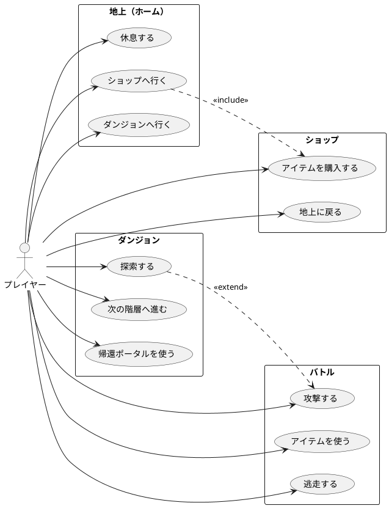

# 要件定義書 — ローグライクダンジョンゲーム

## 1. システム概要

スマホ向け縦画面で動作する、ブラウザベースのローグライクダンジョン探索ゲーム。
プレイヤーは地上を拠点に、ダンジョンを探索し、モンスターと戦いながら最下層を目指す。

## 2. 用語定義

| 用語 | 説明 |
|------|------|
| 地上 | プレイヤーの拠点。ホーム画面/休息/ショップが利用可能 |
| ダンジョン | 複数階層からなる地下探索エリア |
| 階層 | 1画面1階層。探索コマンドを繰り返して進む |
| モンスター | ダンジョン内でランダムに遭遇する敵 |
| バトル | モンスター遭遇時に移行するターン制戦闘 |
| 帰還ポータル | 10階層ごとに設置。アイテムを持ち帰って地上に戻れる |
| HP | ヒットポイント。0になるとゲームオーバー |
| ゴールド | 所持金。ショップでの購入に使用 |

## 3. MVP機能一覧

### 3.1 地上（ホーム）

| ID | 機能 | 説明 |
|----|------|------|
| H01 | 休息 | HPを全回復する（自動保存） |
| H02 | ショップへ行く | ショップ画面に遷移 |
| H03 | ダンジョンへ行く | 1階層目から探索開始 |
| H04 | ステータス割り振り | 未割り振りポイントがあれば表示（レベルアップ後など）|
| H05 | ニューゲーム | セーブデータを消去してリロード |

### 3.2 ショップ

| ID | 機能 | 説明 |
|----|------|------|
| S01 | アイテム一覧表示 | 購入可能なアイテムを表示 |
| S02 | アイテム購入 | ゴールドを消費してアイテムを入手 |
| S03 | 地上に戻る | ホーム画面に戻る |

### 3.3 ダンジョン探索

| ID | 機能 | 説明 |
|----|------|------|
| D01 | 探索する | 1回の探索行動。ランダムイベント発生（自動保存） |
| D02 | モンスター遭遇 | 確率でバトルに移行 |
| D03 | 階段発見 | 確率(15%)で次階層への階段を発見 |
| D04 | 階層移動 | 発見後、「次の階層へ」ボタンで移動（自動保存） |
| D05 | 帰還ポータル | 10階層到達時に出現。アイテム持ち帰り可能（自動保存） |
| D06 | 脱出 | 確認後、アイテム・装備・所持金を失い地上へ戻る |
| D07 | 力尽き | HP0でゲームオーバー。アイテムロスト |

### 3.4 バトル

| ID | 機能 | 説明 |
|----|------|------|
| B01 | 攻撃 | 自分の攻撃力でモンスターにダメージ |
| B02 | アイテム使用 | アイテム一覧から選択して使用（回復/ステータスリセット） |
| B03 | 逃走 | 確率でバトルから離脱 |
| B04 | 戦闘結果 | 勝利でゴールド/経験値獲得、レベルアップ時はステータス割り振り画面へ |
| B05 | 敗北 | 力尽きてアイテムロスト、リザルト画面へ |

## 4. イベント確率

| イベント | 確率 | 備考 |
|----------|------|------|
| モンスター遭遇 | 40% | 階層が深いほど強いモンスター |
| アイテム発見 | 15% | 回復アイテムなど |
| 何もなし | 45% | — |
| 階段発見 | 15% | 未発見時のみ判定。`rollStairs()` で独立判定 |

## 5. 経験値/レベルアップ

| 項目 | 仕様 |
|------|------|
| 必要EXP | `level × 10` (Lv1→2: 10, Lv2→3: 20, ...) |
| レベルアップ獲得P | 3ポイント |
| 割り振り先 | 体力(+5HP)、攻撃力(+1)、素早さ(+1)、魔力(+1) |
| 振り直し | 「忘却の薬」(500G)で全リセット可能 |

## 6. セーブ・ロード

- **保存先**: localStorage (キー: `roguelike_save`)
- **保存タイミング**: プレイヤー操作毎（休息、ショップ購入、探索、階層移動、帰還、レベルアップ決定）
- **ロード**: 起動時に自動復元。最後の状態から再開
- **ニューゲーム**: ホーム画面の「ニューゲーム」ボタンでセーブデータをクリア

## 7. 制約条件

- GitHub Pages で静的ホスティング可能であること
- スマートフォンの縦画面で操作可能であること
- TypeScript で記述すること
- 外部ライブラリに極力依存しないこと

---

## 8. ユースケース図

